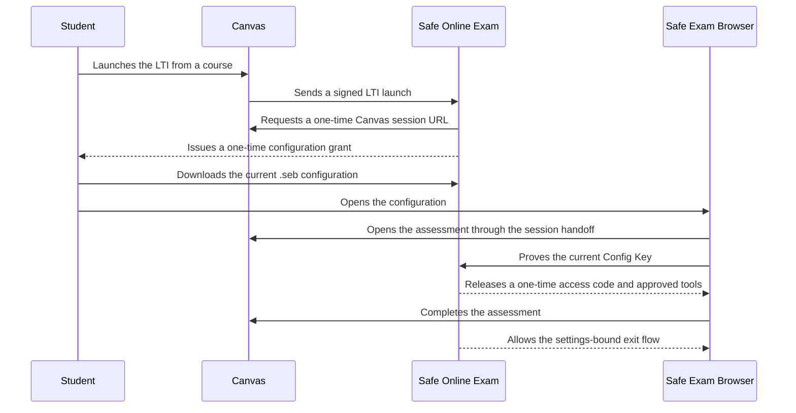

# Safe Online Exam

Safe Online Exam helps schools run Canvas Classic Quizzes and New Quizzes in
[Safe Exam Browser (SEB)](https://safeexambrowser.org/). Instructors decide
which assessments require SEB, students receive a purpose-built `.seb`
configuration, and the Canvas access code is released only after SEB proves it
is using the current configuration.

The project is designed for institution-managed deployments. It includes a
Canvas LTI 1.3 application, a root-account administration workspace, an
instructor course workspace, a student launch and readiness flow, and
production deployment tooling for Docker Compose or Google Cloud Run.

> Safe Online Exam adds technical controls around a Canvas assessment. It does
> not replace instructional planning, identity verification, accommodations,
> device management, proctoring, incident response, or a school’s security and
> privacy review.

## Who It Is For

- **Canvas administrators** install the LTI and OAuth Developer Keys, load the
  detector through the Canvas theme, and operate the school dashboard.
- **Infrastructure teams** deploy the service, PostgreSQL, secrets, backups,
  cleanup, monitoring, and the SEB client identity.
- **Instructors** choose assessments, configure course policy and approved exam
  tools, and enable or disable SEB from Canvas.
- **Students** connect Canvas once, run an optional setup check, and open each
  protected assessment in SEB.

One deployment connects to one Canvas tenant and environment. Use separate
service URLs, databases, secrets, LTI installations, and OAuth credentials for
production, test, beta, or independent Canvas instances.

## What Version 1 Includes

- Canvas LTI 1.3 course navigation and root-account administration placements.
- Canvas OAuth with separate instructor/student and root-account
  administrator capabilities.
- Discovery and management of Classic Quizzes and New Quizzes.
- Course defaults, assessment overrides, start and exit passwords, URL rules,
  course exam tools, quiz-only tools, and school-managed tool presets.
- Certificate-encrypted `.seb` files by default, with an explicit
  instance-level compatibility mode when managed certificate distribution is
  not possible.
- Scoped Canvas session handoff into SEB without copying browser cookies.
- SEB Config Key proof, one-time access-code release, approved-tool release,
  and completion-bound exit.
- PostgreSQL-backed sessions, OAuth grants, settings, one-time state,
  admission limits, and distributed locks.
- Multi-architecture release images for `linux/amd64` and `linux/arm64`.

## Start Here

The documentation is organized by task instead of implementation area:

| If you need to…                                  | Read                                                     |
| ------------------------------------------------ | -------------------------------------------------------- |
| Understand the project and choose a path         | [Documentation guide](docs/README.md)                    |
| Install a published release                      | [Deployment](docs/deployment.md)                         |
| Register the application in Canvas               | [Canvas setup](docs/canvas-setup.md)                     |
| Use the admin, instructor, or student workflows  | [User guide](docs/user-guide.md)                         |
| Configure environment variables and secrets      | [Configuration reference](docs/configuration.md)         |
| Deploy and rotate the SEB client identity        | [Certificate management](docs/certificate-management.md) |
| Understand trust boundaries and data flow        | [Architecture](docs/architecture.md)                     |
| Test a change or complete release acceptance     | [Testing and acceptance](docs/testing.md)                |
| Diagnose a launch, OAuth, detector, or SEB issue | [Troubleshooting](docs/troubleshooting.md)               |
| Prepare a new public release                     | [Maintainer release guide](docs/releasing.md)            |
| Review changes between stable versions           | [Changelog](CHANGELOG.md)                                |
| Report a vulnerability privately                 | [Security policy](.github/SECURITY.md)                   |

## Install A Published Release

Production deployments should use a versioned GitHub Release and the exact
container digest recorded by that release. Moving tags such as `latest` are
for discovery, not production pinning.

### Docker Compose

The release bundle contains PostgreSQL 17, migrations, scheduled-cleanup
support, protected secret bootstrap, an upgrade helper, and optional Caddy
HTTPS.

```bash
export VERSION=1.0.3
curl -fLO "https://github.com/JSB2010/safe-online-exam/releases/download/v${VERSION}/safe-online-exam-${VERSION}-compose.tar.gz"
curl -fLO "https://github.com/JSB2010/safe-online-exam/releases/download/v${VERSION}/safe-online-exam-${VERSION}-compose.tar.gz.sha256"
sha256sum --check "safe-online-exam-${VERSION}-compose.tar.gz.sha256"
tar -xzf "safe-online-exam-${VERSION}-compose.tar.gz"
cd "safe-online-exam-${VERSION}"
./setup.sh
```

The application binds to loopback by default. Canvas requires a stable public
HTTPS origin, so place a trusted TLS reverse proxy in front or use the bundle’s
optional Caddy profile.

### Google Cloud Run

The Cloud Run release bundle provisions or validates the required Google Cloud
resources, reserves a stable service URL, supports the two Canvas setup
handoffs, pins numbered Secret Manager versions, runs migrations before
traffic, schedules cleanup, and stages upgrades without traffic until
readiness checks pass.

```bash
export CLOUDRUN_VERSION="1.0.3"
curl -fLO "https://github.com/JSB2010/safe-online-exam/releases/download/v${CLOUDRUN_VERSION}/safe-online-exam-${CLOUDRUN_VERSION}-cloud-run.tar.gz"
curl -fLO "https://github.com/JSB2010/safe-online-exam/releases/download/v${CLOUDRUN_VERSION}/safe-online-exam-${CLOUDRUN_VERSION}-cloud-run.tar.gz.sha256"
sha256sum --check "safe-online-exam-${CLOUDRUN_VERSION}-cloud-run.tar.gz.sha256"
tar -xzf "safe-online-exam-${CLOUDRUN_VERSION}-cloud-run.tar.gz"
cd "safe-online-exam-${CLOUDRUN_VERSION}-cloud-run"
./setup.sh
```

See [Deployment](docs/deployment.md) before choosing a Cloud SQL profile,
opening public access, or moving an existing installation.

## How The Protection Flow Works



The detector’s buttons and sidebar are user-interface affordances. The
generated SEB URL filter, current configuration fingerprint, server-side
proof, and Canvas-authored completion state are the enforcement boundaries.

## Technology And Runtime

- Node.js 24 and npm 11
- NestJS 11 on Express
- React 19 and Vite
- PostgreSQL 17 or newer
- Vitest and Playwright
- A nonroot distroless production image

The runtime is provider-neutral: it needs PostgreSQL, a public HTTPS origin,
secret injection, a migration job before application traffic, and scheduled
cleanup. The maintained deployment targets are Docker Compose and Google Cloud
Run with Cloud SQL.

Google Cloud Run with Cloud SQL is the recommended managed deployment. Docker
Compose is the maintained self-hosted alternative.

## Local Development

Install the pinned dependency graph and run the complete non-browser gate:

```bash
npm ci
npm run verify
```

Then run the PostgreSQL and browser layers when relevant:

```bash
npm run verify:postgres
npm run test:e2e
```

For a local UI and public-route smoke server that does not contact Canvas or
PostgreSQL:

```bash
npm run build
HOST=127.0.0.1 \
USE_IN_MEMORY_STORE=true \
TOOL_URL=http://localhost:8080 \
LTI_CLIENT_ID=test-client \
CANVAS_API_CLIENT_ID=test \
CANVAS_API_CLIENT_SECRET=test \
npm start
```

The application does not automatically load `.env`. Export variables, use a
process manager, or use Compose’s explicit environment file. Start with
[`.env.example`](.env.example) for local development and read the
[configuration reference](docs/configuration.md) before a deployed install.

## Compatibility Contracts

Canvas and deployed clients depend on these stable public routes:

- `GET /lti/config`
- `GET|POST /lti/login`
- `GET|POST /lti/launch`
- `GET /.well-known/jwks.json`
- `GET /health` and `GET /ready`
- `GET /js/canvas-seb-detector.js`
- `GET /js/canvas-seb-theme-loader.js`
- `GET /api/seb/canvas-detector.js`
- `GET /api/seb/requirement/:courseId/:quizId`
- `GET /api/oauth2callback`
- `GET /seb/config/:courseId/:contentId.seb`

Classic Quiz content IDs are `classicquiz_{quizId}`. New Quiz content IDs are
`newquiz:{courseId}:{assignmentId}`. Treat route, identifier, migration, and
configuration changes as compatibility changes.

## Project Status And Support

Version 1 is a stable public release line, but every institution remains
responsible for validating its own Canvas configuration, supported SEB client
versions, operating systems, accessibility requirements, security controls,
backup recovery, and assessment workflow before production use.

Use GitHub issues for reproducible non-sensitive bugs and feature proposals.
Do not put student data, school URLs, credentials, access codes, session URLs,
or private keys in an issue. Report suspected vulnerabilities through
[GitHub private vulnerability reporting](https://github.com/JSB2010/safe-online-exam/security/advisories/new).

## License

Safe Online Exam is source-available under the
[PolyForm Noncommercial License 1.0.0](LICENSE), not an OSI-approved
open-source license. Eligible institutions may self-host and modify it for
permitted noncommercial use. Commercial hosting, implementation, support,
resale, and competing services require separate permission.

Read [commercial licensing](COMMERCIAL-LICENSE.md),
[contributing](CONTRIBUTING.md), [third-party notices](THIRD-PARTY-NOTICES.md),
and [trademark guidance](TRADEMARKS.md) before redistribution or commercial
use.
