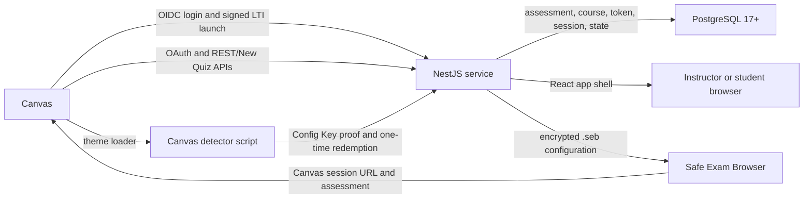

# Architecture

## System Purpose

Canvas Safe Exam Browser LTI is an LTI 1.3 tool for requiring Safe Exam Browser (SEB) on Canvas Classic Quizzes and New Quizzes. It has three connected responsibilities:

1. Give instructors a course-scoped interface for discovering Canvas assessments and managing SEB policy.
2. Generate protected SEB configurations and establish a Canvas session inside SEB without transferring a normal-browser session cookie.
3. Release the Canvas access code and approved web-tool capability only when SEB proves that it is using the current configuration.

The service is not a general Canvas proxy. A deployment is configured for one Canvas origin and one LTI deployment boundary. All identity and authorization data used for a request comes from a validated LTI launch or a server-issued, bound capability.

## Runtime Shape

The application is one Node.js process. NestJS controllers expose HTTP endpoints, services own protocol and business behavior, repositories provide PostgreSQL storage in deployed environments and in-memory storage for local/test work, and React renders page views supplied by the server app shell. The detector is a separately served browser asset that runs on Canvas quiz pages.

### Deployment portability

The production image has no runtime dependency on a Google Cloud SDK. Durable state is in PostgreSQL, application configuration is read from environment variables or mounted files, and the HTTP process listens on a configurable host and port. Multiple instances share sessions, one-time claims, admission budgets, and operation locks through PostgreSQL, so sticky sessions and a writable application filesystem are not required.

Cloud Run, Cloud SQL, Artifact Registry, Secret Manager, and Cloud Build are the recommended managed deployment, not application requirements. Another platform can run the same image when it provides PostgreSQL 17+, public HTTPS ingress, secret injection, an exact-image migration job before traffic, and a scheduled cleanup job. [Deployment](deployment.md) defines both supported operating models.

## Code Ownership

| Area                      | Primary locations                                                           | Responsibility                                                                                                     |
| ------------------------- | --------------------------------------------------------------------------- | ------------------------------------------------------------------------------------------------------------------ |
| Bootstrap and HTTP policy | `src/server/main.ts`, `src/server/http/`                                    | Express session setup, CORS, security headers, app-shell rendering, request integrity, bounded upstream responses. |
| Configuration             | `src/server/config/app-config.ts`                                           | Environment parsing, normalizing aliases, and hardened-runtime validation.                                         |
| LTI                       | `lti.controller.ts`, `lti.service.ts`, `lti-state.service.ts`               | OIDC initiation, signed token validation, state encryption/replay claim, role routing, dynamic registration.       |
| Canvas OAuth and APIs     | `oauth.controller.ts`, `canvas-api.service.ts`                              | Instructor/student authorization, token refresh, bounded Canvas REST/New Quiz requests, session-token handoff.     |
| Assessment policy         | `quiz.controller.ts`, `assessment.service.ts`, `course-settings.service.ts` | Discovery, Canvas access-code mutations, course defaults, per-assessment overrides, exam tools.                    |
| SEB lifecycle             | `seb.controller.ts`, `seb-configuration.service.ts`, `seb-*.service.ts`     | Configuration grants, configuration generation, proof, access-code redemption, setup check, exit grants.           |
| Browser detector          | `src/server/assets/canvas-seb-detector.js`, `static-js.controller.ts`       | Quiz-page launch UI, access-code filling, approved tools, completion detection, diagnostic reporting.              |
| Persistence               | `src/server/data/`, `session-store.ts`                                      | PostgreSQL migrations, atomic consumption/claims, distributed rate budgets, locks, Express sessions.               |

## Identity And Authorization

### LTI launch

Canvas initiates OIDC at `/lti/login`. The service verifies the issuer, requested target link URI, configured client ID, and configured deployment ID before creating encrypted state. State is valid for ten minutes and is additionally bound to a short-lived, `HttpOnly`, secure browser transaction cookie.

Canvas posts an ID token to `/lti/launch`. The service validates:

- RS256 signing against the configured Canvas JWKS;
- issuer, audience, nonce, token age, issued/expiry timestamps, LTI version, message type, and deployment ID;
- the target link URI and initiation state tuple;
- the initiating browser transaction cookie; and
- a durable, atomic PostgreSQL state claim to prevent replay.

After successful validation, the server regenerates the Express session and stores a verified LTI principal. The principal contains only signed launch claims: issuer, deployment, subject, numeric Canvas user ID, course ID, roles, and custom fields. Query parameters and request bodies cannot substitute for it.

Instructors receive the management view. Students receive a launch-only flow and never receive instructor management actions. A signed Canvas numeric user ID is required for Canvas REST authorization; a Canvas administrator must refresh the LTI registration if Canvas does not supply it.

### Canvas OAuth

An LTI launch authenticates a person but does not authorize Canvas API calls. The application uses a separate Canvas OAuth authorization for API access:

1. An instructor opens `/api/oauth2authorize` or `/api/oauth2reauthorize` from an existing verified launch.
2. The service records encrypted, one-time state and redirects to Canvas.
3. `/api/oauth2callback` verifies state and exchanges the authorization code.
4. PostgreSQL stores the token by numeric Canvas user ID; `CanvasApiService` refreshes it when necessary.

Every Canvas OAuth connection requests the same complete application scope set, including the session-token permission required for SEB handoff: `url:GET|/api/v1/login/session_token`. This keeps one durable grant valid when a person is an instructor in one course and a student in another; Canvas still enforces their actual course permissions. The one-time Canvas session URL is generated server-side for each student configuration download. Browser cookies are never copied to the configuration or exposed through the API.

## Assessment And Course Model

### Identifiers

All persisted assessment records use a canonical public content ID:

| Assessment type | Canonical ID                        | Canvas mutation target   |
| --------------- | ----------------------------------- | ------------------------ |
| Classic Quiz    | `classicquiz_{quizId}`              | Quiz access-code API     |
| New Quiz        | `newquiz:{courseId}:{assignmentId}` | New Quiz access-code API |

The `assessments` table stores Canvas discovery data, availability verification, and SEB state. `courses` stores course-level defaults and its exam-tool catalog. Course defaults can provide URL policy, start/exit password policy, and selected exam tools; an assessment may inherit defaults or retain an explicit list of course tool IDs.

### Canvas discovery and availability

Instructor discovery refreshes Classic and New Quiz data from Canvas. A learner can use an assessment only when its cached Canvas verification is current, explicitly verified, published, and within its global unlock/lock window. The verification window is 24 hours. Missing records are retained for instructor reconciliation but fail closed for learners; a failed refresh marks the cached discovery stale.

Assessment updates use short-lived PostgreSQL operation locks while Canvas and database state are changed. Atomic compare-and-delete/insert operations prevent overlapping workers from owning the same lease and help keep Canvas access codes aligned with persisted SEB settings.

### Exam tools and URL policy

Course-owned exam tools have an exact HTTPS launch URL and typed resource rules: exact URL, a path and descendants, or an explicitly confirmed whole-domain rule. User-entered general rules are restricted to exact HTTPS URLs or concrete domains. Wildcards, credentials, identity-provider hosts, arbitrary regular expressions, and unsafe historical patterns are rejected or quarantined.

The detector sidebar is an affordance only. The SEB URL filter in the generated configuration is the control that determines what can load. Changing any selected tool or URL policy changes the configuration fingerprint; students must download a new configuration.

## SEB Lifecycle

### Instructor configuration

When an instructor enables SEB, `AssessmentService` creates an access code, mutates the appropriate Canvas assessment, and persists SEB state only after the mutation is successful. Enabling requires an effective exit password: assessment override, course default, or configured managed default. Optional start passwords protect the inner configuration payload. Password responses are redacted by default; an instructor can make a narrowly bound, short-lived reveal request.

### Student configuration download

Student downloads do not use a reusable `.seb` link. A verified LTI principal requests a configuration grant, and the server mints a one-time 120-second capability bound to the principal, course, content ID, and current settings fingerprint. `GET /seb/config/:courseId/:contentId.seb` consumes that capability.

For a student download, the service obtains a fresh Canvas session URL and builds the SEB start URL around it. The configuration contains the canonical Canvas assessment entry route, SEB URL policy, Config Key behavior, and an HMAC-bound quit URL. It is then encrypted to the configured public certificate. The service holds only public encryption material.

### Config Key proof and access-code release

On the Canvas assessment page, the detector gets the SEB Config Key hash and current browser URL through the SEB JavaScript API. It requests a proof from `POST /api/seb/access-proof/:courseId/:quizId`; the server verifies the assessment, current settings fingerprint, URL family, and Config Key hash before returning a one-time proof token.

`POST /api/seb/access-code/:courseId/:quizId` consumes that proof token. It returns the access code, approved tools, and an exit grant with sensitive response headers. A proof is valid for two minutes and can be consumed once. The detector then fills only an unambiguous Canvas access-code prompt. It does not treat DOM content as authorization.

### Completion and exit

The detector waits for Canvas-authored completion evidence. Classic Quiz completion requires a successful final submission and the matching Canvas result structure; New Quiz completion requires the authoritative result UI. On confirmed completion, the detector uses a settings-bound exit grant to display a quit link. Unbound manual/automatic quit paths intentionally return `410` rather than accepting a general-purpose quit request.

### Setup check

`/seb/check/config.seb` generates a separate configuration for testing certificate decryption, SEB runtime detection, connectivity, storage, and Config Key proof. It never releases an assessment access code and does not establish device trust. It should be part of pre-exam readiness testing, not a substitute for device management.

## Configuration Security Boundary

Generated assessment configurations include a strict Canvas and approved-resource URL filter, SEB Config Key proof setup, session-monitoring and kiosk-related policy, exit protection, and optional start-password protection. The exact plist is built by `SebConfigurationService`; use integration testing with the supported SEB clients rather than assuming a setting is honored by every client release or operating system.

In a hardened runtime, certificate encryption is mandatory. The public X.509 certificate or public key permits wrapping the file; the matching private identity belongs only on approved client devices. [Certificate management](certificate-management.md) defines the required handling and rotation model.

### Assessment and setup-check configuration policy

Assessment configurations use the SEB exam-start purpose and include the assessment start URL, an HMAC-bound quit URL, URL filter rules, a derived Browser Exam Key, and a Config Key salt. If an instructor sets a start password, the inner configuration is password-protected before certificate wrapping. The outer encrypted file uses SEB’s public-key-hash (`pkhs`) format when a public certificate is configured.

The setup-check configuration is deliberately different from an assessment configuration: it starts at `/seb/check`, has no assessment access code, allows quit without an assessment exit password, and cannot redeem an access-code proof. It applies the same macOS installation/AAC checks as an assessment so a client incompatibility is discovered before an exam.

Assessment lockdown settings explicitly block configuration surfaces that would undermine the browser boundary, including application/user switching, virtual machines, additional displays, screen capture/sharing, AirPlay, Siri and dictation, developer console, printing, downloads/uploads, open/save panels, and non-SEB clipboard transfer. They leave Canvas-required browser behavior, reload, JavaScript, and SEB-managed browser windows available so Canvas and approved web tools can function.

On macOS, the generated policy requires Automatic Assessment Configuration (AAC) through both `enableMacOSAAC` and `lockdownModePolicy`, requires installation from the system Applications location, and sets a macOS 12.1 floor through explicit version-number settings plus the coarse version field. The overlapping AAC keys cover supported SEB client generations; they do not replace device management. AAC may block third-party assistive technology, so an accommodation that requires it needs a separate approved assessment/proctoring arrangement rather than a weakened common configuration.

On Windows, the configuration requests the OS-session and SEB-service controls used by the generated policy, including the kiosk desktop, process/session monitoring, and the supported SEB version floor. Client releases that do not understand a newer configuration key cannot enforce that key, so managed-device policy must also pin the approved SEB client version and integrity baseline. Validate the complete policy with a real supported client after SEB or operating-system updates.

## Persistence And Expiration

| Table                 | Contents                                                                                            | Expiration behavior                                           |
| --------------------- | --------------------------------------------------------------------------------------------------- | ------------------------------------------------------------- |
| `assessments`         | Canvas discovery and per-assessment SEB state                                                       | Durable until intentionally changed.                          |
| `courses`             | Course defaults, setup state, and exam-tool catalog                                                 | Durable until intentionally changed.                          |
| `canvas_oauth_tokens` | Canvas access and refresh tokens                                                                    | Durable; lifecycle is driven by Canvas authorization/refresh. |
| `sessions`            | Express session payloads keyed by a hashed session ID                                               | Expired rows are removed by bounded cleanup.                  |
| `transient_states`    | LTI replay claims, OAuth state, configuration grants, proofs, session-handoff records, rate budgets | Expired rows are removed by bounded cleanup.                  |
| `operation_locks`     | Short assessment-update leases                                                                      | Expired rows are removed by bounded cleanup.                  |

PostgreSQL transactions and row locks implement atomic state claims, one-time token consumption, rate-budget increments, and operation-lock ownership. Claim/consume operations use conditional mutations so two app instances cannot both win. Cleanup selects bounded batches with `FOR UPDATE SKIP LOCKED`, allowing safe overlap without long table locks. This is why multiple app instances can share runtime state without sticky sessions.

Schema changes are explicit, ordered migrations recorded with checksums in `schema_migrations`. The application never mutates schema on ordinary startup; `/ready` fails until all checked-in migrations are applied. A migration job must complete before traffic reaches a new image.

## HTTP And Security Controls

- Security headers are applied before application routes; Express disables `x-powered-by` and trusts one proxy hop.
- Sessions use `HttpOnly` cookies and use `Secure; SameSite=None` when the configured tool URL is HTTPS or the profile is production.
- Sensitive proof, access-code, and password-reveal responses are no-store and are bound to the verified session/principal.
- LTI initiation and token validation use process-local and PostgreSQL-backed admission budgets. Configuration-grant minting is rate-limited per principal and IP.
- Canvas API calls are constrained to the configured Canvas origin and `/api/v1` base. Responses have size limits and upstream deadlines; a `401` triggers at most one safe token refresh/retry.
- The public detector script has two stable paths. Debug or diagnostic modes serve a readable, non-cacheable asset; normal production mode serves the built minified asset from the same public path.

## Route Reference

### Public and LTI routes

| Route                                                | Purpose                                              |
| ---------------------------------------------------- | ---------------------------------------------------- |
| `GET /`, `GET /login`                                | Public service status and Canvas-launch fallback.    |
| `GET /health`, `GET /login/health`, `GET /js/health` | Lightweight health responses.                        |
| `GET /setup`, `GET /setup/guide`                     | Public role-oriented setup handoff.                  |
| `GET /.well-known/jwks.json`                         | Public LTI signing keys.                             |
| `GET /lti/config`                                    | Dynamic Canvas LTI registration document.            |
| `GET /lti/login`, `POST /lti/login`                  | OIDC initiation.                                     |
| `GET /lti/launch`, `POST /lti/launch`                | Signed LTI launch handling and session-based reload. |

### Canvas OAuth routes

| Route                                                    | Caller and purpose                                                                                 |
| -------------------------------------------------------- | -------------------------------------------------------------------------------------------------- |
| `GET /api/oauth2authorize`, `GET /api/oauth2reauthorize` | Verified instructor begins or repeats Canvas API authorization.                                    |
| `GET /api/student-session-authorize`                     | Verified student begins the complete application authorization and returns to the session handoff. |
| `GET /api/oauth2callback`                                | Canvas OAuth redirect URI; state and launch session are validated.                                 |
| `GET /api/oauth2status`                                  | Verified instructor checks stored authorization availability.                                      |

### Instructor assessment routes

All routes below are under `/api/quizzes` and require the verified instructor/request-integrity boundary unless they are simple reads exposed through the current session.

| Route                                                                                      | Purpose                                                  |
| ------------------------------------------------------------------------------------------ | -------------------------------------------------------- |
| `GET /api/quizzes`, `GET /api/quizzes/:quizId`, `GET /api/quizzes/seb-settings`            | Read cached course assessment/settings views.            |
| `POST /api/quizzes/course/:courseId/refresh`                                               | Refresh Classic Quiz and New Quiz discovery from Canvas. |
| `GET /api/quizzes/course/:courseId/defaults`, `PUT /api/quizzes/course/:courseId/defaults` | Read or update course defaults and exam-tool catalog.    |
| `POST /api/quizzes/course/:courseId/passwords/reveal`                                      | Session-bound course password reveal.                    |
| `POST /api/quizzes/:courseId/:quizId/passwords/reveal`                                     | Session-bound assessment password reveal.                |
| `PUT /api/quizzes/:quizId/seb`, `POST /api/quizzes/seb-config-structured`                  | Update SEB settings.                                     |
| `POST /api/quizzes/:courseId/:quizId/seb/enable`                                           | Enable SEB and set the Canvas access code.               |
| `POST /api/quizzes/:courseId/:quizId/seb/disable`                                          | Disable SEB and remove Canvas access-code protection.    |
| `POST /api/quizzes/:courseId/:quizId/seb/reset-defaults`                                   | Return one assessment to course defaults.                |
| `POST /api/quizzes/:courseId/:quizId/seb/regenerate-code`                                  | Rotate the protected Canvas access code.                 |
| `GET /api/quizzes/:courseId/:quizId/seb/config`                                            | Redirect to the current configuration flow.              |
| `GET /api/quizzes/:courseId/:quizId/seb/status`                                            | Return the secret-free SEB status view.                  |

### Student SEB, proof, and exit routes

| Route                                                                                             | Purpose                                                                            |
| ------------------------------------------------------------------------------------------------- | ---------------------------------------------------------------------------------- |
| `GET /seb/quiz/:courseId/:quizId`                                                                 | Render assessment SEB-required/download view.                                      |
| `POST /api/seb/config-grant/:courseId/:contentId`                                                 | Mint a one-time configuration download grant from a verified launch.               |
| `GET /seb/config/:courseId/:contentId.seb`                                                        | Consume a configuration grant and download the encrypted assessment configuration. |
| `GET /seb/config-encryption-certificate.pem`, `GET /seb/config-encryption-certificate.cer`        | Public active encryption certificate in PEM/DER form.                              |
| `POST /api/seb/session-readiness`, `POST /api/seb/session-readiness/dismiss`                      | Test or dismiss the optional student setup prompt.                                 |
| `GET /seb/check/config.seb`, `GET /seb/check`, `POST /api/seb/check-proof`, `GET /seb/check/quit` | Setup-check configuration, page, proof, and quit flow.                             |
| `GET /seb/launch/:contentId`, `POST /seb/launch/:contentId`, `GET /seb/launch/:contentId/login`   | Signed/direct assessment-launch handoff.                                           |
| `GET /seb/config/:courseId/:quizId`, `GET /seb/config/:quizId`                                    | Compatibility redirects into the current configuration flow.                       |
| `POST /api/seb/access-proof/:courseId/:quizId`                                                    | Validate Config Key proof and mint the one-time access-code proof.                 |
| `POST /api/seb/access-code/:courseId/:quizId`                                                     | Redeem a proof for the access code, approved tools, and exit grant.                |
| `GET /api/seb/access-code/:courseId/:quizId`                                                      | Explicit method guidance; redemption is POST-only.                                 |
| `GET /api/seb/tools/:courseId/:quizId`                                                            | Return the current approved tool view under the proof/session boundary.            |
| `GET /seb/exit/session/:courseId/:quizId/:grant`                                                  | Render a validated post-submission exit page.                                      |
| `GET /seb/exit/:courseId/:quizId`                                                                 | Render a non-terminal/manual exit page.                                            |
| `GET /seb/exit/quit/:courseId/:quizId/:grant`                                                     | Redirect a validated exit grant to the configuration-bound SEB quit URL.           |
| `GET /seb/exit/complete/:courseId/:quizId/:token`                                                 | Render the HMAC-authenticated SEB quit completion page.                            |
| `GET /seb/exit/quit/:courseId/:quizId`, `GET /seb/exit/manual/:courseId/:quizId`                  | Deliberately unavailable unbound quit routes; return `410`.                        |

### Detector and diagnostics routes

| Route                                   | Purpose                                                                                               |
| --------------------------------------- | ----------------------------------------------------------------------------------------------------- |
| `GET /js/canvas-seb-detector.js`        | Stable detector script URL for new Canvas theme loaders.                                              |
| `GET /js/canvas-seb-theme-loader.js`    | Hosted, quiz-route-limited loader for Canvas deployments that cannot serve uploaded theme JavaScript. |
| `GET /api/seb/canvas-detector.js`       | Stable compatibility alias for an existing loader.                                                    |
| `POST /api/debug/canvas-detector-trace` | Accepts sanitized detector diagnostics only when debug/diagnostic mode is enabled.                    |

The route handlers are the source of truth for parameters and response schemas. Treat unlisted query parameters or output fields as implementation details.
